<!-- README.md is generated from README.Rmd. Please edit that file -->

# parcutils

<!-- badges: start -->

[](https://github.com/cparsania/parcutils)
[](https://lifecycle.r-lib.org/articles/stages.html#experimental)

<!-- badges: end -->

The goal of `parcutils` is to provide day to day bioinformatics utility
functions. Most of the functions in the package are useful for analyzing
and visualizing complex RNA-seq studies.

## Installation

``` r


if(require("devtools") && require("BiocManager")){
  options(repos = BiocManager::repositories() )
  devtools::install_github("cparsania/parcutils")
} else{
  install.packages(c("devtools","BiocManager"))
  options(repos = BiocManager::repositories() )
  devtools::install_github("cparsania/parcutils")
}
```

## RNA-seq analysis

### Differential expression analysis

#### Prepare a count table

``` r

count_file <- system.file("extdata","toy_counts.txt" , package = "parcutils")

count_data <- readr::read_delim(count_file, delim = "\t")

count_data 
#> # A tibble: 5,000 × 10
#>    gene_id       contr…¹ contr…² contr…³ treat…⁴ treat…⁵ treat…⁶ treat…⁷ treat…⁸
#>    <chr>           <dbl>   <dbl>   <dbl>   <dbl>   <dbl>   <dbl>   <dbl>   <dbl>
#>  1 ENSG00000173…       0       0       0       0       0       0       0       0
#>  2 ENSG00000106…       1       0       2       0       0       1       1       1
#>  3 ENSG00000131…       2       0       2       0       0       1       1       1
#>  4 ENSG00000154…     652     690     639     607     453     461     809     994
#>  5 ENSG00000196…    3372    3631    3188    4644    3168    3514    4789    5466
#>  6 ENSG00000173…     694     784     829     974     580     716     413     545
#>  7 ENSG00000140…      87      73      81     100      77      72      63      87
#>  8 ENSG00000187…       4       4       2       0       5       2       1       4
#>  9 ENSG00000139…    1374    1789    1564    1933    1459    1584     482     729
#> 10 ENSG00000165…    3639    4533    3921    3879    3500    3439    3324    4683
#> # … with 4,990 more rows, 1 more variable: treat2_rep3 <dbl>, and abbreviated
#> #   variable names ¹​control_rep1, ²​control_rep2, ³​control_rep3, ⁴​treat1_rep1,
#> #   ⁵​treat1_rep2, ⁶​treat1_rep3, ⁷​treat2_rep1, ⁸​treat2_rep2
```

#### Group replicates by samples

To run DESeq2, replicates for each sample needs to be grouped.

``` r

sample_info <- count_data %>% colnames() %>% .[-1]  %>%
 tibble::tibble(samples = . , groups = rep(c("control" ,"treatment1" , "treatment2") , 
                                           each = 3))
sample_info
#> # A tibble: 9 × 2
#>   samples      groups    
#>   <chr>        <chr>     
#> 1 control_rep1 control   
#> 2 control_rep2 control   
#> 3 control_rep3 control   
#> 4 treat1_rep1  treatment1
#> 5 treat1_rep2  treatment1
#> 6 treat1_rep3  treatment1
#> 7 treat2_rep1  treatment2
#> 8 treat2_rep2  treatment2
#> 9 treat2_rep3  treatment2
```

> NOTE: Samples which are present in the object ‘sample_info’ will be
> considered for differential expressed analysis.

#### Run `DESeq2` for multiple differential gene comparison.

``` r

res <- parcutils::run_deseq_analysis(counts = count_data ,
                         sample_info = sample_info,
                         column_geneid = "gene_id" ,
                         cutoff_lfc = 1,
                         cutoff_pval = 0.05,
                         group_numerator = c("treatment1", "treatment2") ,
                         group_denominator = c("control"))
```

#### Let’s have a look in to `res`

``` r

res
#> ┌────────────────────────────┐
#> │                            │
#> │   Summary of DE analysis   │
#> │                            │
#> └────────────────────────────┘
#> 
#> 
#> 
#> treatment1_VS_control 
#> • number of up genes   : 13.
#> • number of down genes : 28.
#> ──────────────────────────────
#> 
#> treatment2_VS_control 
#> • number of up genes   : 333.
#> • number of down genes : 502.
#> ──────────────────────────────
```

`res` is an object of improved `dataframe` - `tibble`. Each row in the
`res` is a differential comparison which can be identified by the value
from the column `comp`.

``` r

res$de_comparisons
#> [1] "treatment1_VS_control" "treatment2_VS_control"
```

Data related to each differential comparison can be found from other
columns of `res`.

For example, summary of differently expressed genes can be found from
the column `deg_summmary`

``` r

res$deg_summmary
#> $treatment1_VS_control
#> # A tibble: 3 × 2
#>   regul     n
#>   <chr> <int>
#> 1 Down     28
#> 2 other  3993
#> 3 Up       13
#> 
#> $treatment2_VS_control
#> # A tibble: 3 × 2
#>   regul     n
#>   <chr> <int>
#> 1 Down    502
#> 2 other  3199
#> 3 Up      333
```

As described below there are several helper functions to get data from
the `res` .

## Get data from `res` using helper functions

``` r

# get normalised gene expression value for all genes across all samples. 
parcutils::get_normalised_expression_matrix(x = res, 
                                            samples = NULL,
                                            genes = NULL,
                                            summarise_replicates = FALSE)
#> # A tibble: 4,034 × 10
#>    gene_id       treat…¹ treat…² treat…³ contr…⁴ contr…⁵ contr…⁶ treat…⁷ treat…⁸
#>    <chr>           <dbl>   <dbl>   <dbl>   <dbl>   <dbl>   <dbl>   <dbl>   <dbl>
#>  1 ENSG00000154…  4.40e2  4.61e2 4.56e+2   694.   6.87e2  6.76e2  8.76e2  1.07e3
#>  2 ENSG00000196…  3.37e3  3.22e3 3.48e+3  3591.   3.62e3  3.37e3  5.19e3  5.87e3
#>  3 ENSG00000173…  7.07e2  5.90e2 7.09e+2   739.   7.81e2  8.77e2  4.47e2  5.85e2
#>  4 ENSG00000140…  7.26e1  7.83e1 7.13e+1    92.7  7.27e1  8.57e1  6.82e1  9.34e1
#>  5 ENSG00000139…  1.40e3  1.48e3 1.57e+3  1463.   1.78e3  1.66e3  5.22e2  7.82e2
#>  6 ENSG00000165…  2.81e3  3.56e3 3.40e+3  3875.   4.51e3  4.15e3  3.60e3  5.03e3
#>  7 ENSG00000179…  1.27e4  1.25e4 1.37e+4 13257.   1.34e4  1.40e4  1.08e4  1.51e4
#>  8 ENSG00000188…  4.61e2  4.34e2 4.59e+2   540.   5.92e2  5.66e2  4.68e2  5.80e2
#>  9 ENSG00000249…  0       2.03e0 9.90e-1     0    1.10e1  2.12e0  2.17e0  1.07e0
#> 10 ENSG00000110…  2.18e0  9.15e0 9.90e+0    11.7  5.97e0  1.59e1  5.42e0  4.29e0
#> # … with 4,024 more rows, 1 more variable: treat2_rep3 <dbl>, and abbreviated
#> #   variable names ¹​treat1_rep1, ²​treat1_rep2, ³​treat1_rep3, ⁴​control_rep1,
#> #   ⁵​control_rep2, ⁶​control_rep3, ⁷​treat2_rep1, ⁸​treat2_rep2

# average gene expression values across relicates  
parcutils::get_normalised_expression_matrix(x = res, 
                                            samples = NULL,
                                            genes = NULL,
                                            summarise_replicates = T, 
                                            summarise_method = "median")
#> # A tibble: 4,034 × 4
#>    gene_id                  control treatment1 treatment2
#>    <chr>                      <dbl>      <dbl>      <dbl>
#>  1 ENSG00000000971:CFH       7349.      5727.      9849. 
#>  2 ENSG00000001461:NIPAL3     134.       126.        68.2
#>  3 ENSG00000001497:LAS1L     9282.      8228.      7678. 
#>  4 ENSG00000001631:KRIT1    23294.     29183.     20375. 
#>  5 ENSG00000002746:HECW1       66.0       31.9       24.9
#>  6 ENSG00000003056:M6PR      6538.      7394.      6694. 
#>  7 ENSG00000003436:TFPI       248.       225.       200. 
#>  8 ENSG00000003509:NDUFAF7    462.       495.       384. 
#>  9 ENSG00000004766:VPS50       40.2       38.6      121. 
#> 10 ENSG00000004864:SLC25A13   370.       396.       844. 
#> # … with 4,024 more rows


# get fold change values for all genes and all comparisons.

q_genes = c("ENSG00000196415:PRTN3", "ENSG00000221988:PPT2", "ENSG00000163138:PACRGL", "ENSG00000183840:GPR39", "ENSG00000146700:SSC4D", "ENSG00000163746:PLSCR2", "ENSG00000155918:RAET1L", "ENSG00000151458:ANKRD50", "ENSG00000167074:TEF", "ENSG00000130159:ECSIT")

parcutils::get_fold_change_matrix(x = res, 
                                  sample_comparisons = res$de_comparisons, 
                                  genes = q_genes)
#> # A tibble: 10 × 3
#>    gene_id                 treatment1_VS_control treatment2_VS_control
#>    <chr>                                   <dbl>                 <dbl>
#>  1 ENSG00000196415:PRTN3                 -0.0714                 0.729
#>  2 ENSG00000221988:PPT2                   0.0769                 0.699
#>  3 ENSG00000163138:PACRGL                 0.173                  0.691
#>  4 ENSG00000183840:GPR39                  0.170                  0.904
#>  5 ENSG00000146700:SSC4D                  0.0793                 0.773
#>  6 ENSG00000163746:PLSCR2                 0.0321                 0.747
#>  7 ENSG00000155918:RAET1L                 0.467                  2.63 
#>  8 ENSG00000151458:ANKRD50               -0.0441                 1.91 
#>  9 ENSG00000167074:TEF                   -0.0815                 0.681
#> 10 ENSG00000130159:ECSIT                  0.0317                 0.751


# get differentially expressed genes for given comparison 

parcutils::get_genes_by_regulation(x = res, 
                                  sample_comparison = "treatment1_VS_control", 
                                  regulation = "both" # can be one of the "up" , "down" , "both", "other", "all"
                                  )
#>     ENSG00000250305:TRMT9B      ENSG00000134308:YWHAQ 
#>                       down                       down 
#>    ENSG00000123575:FAM199X   ENSG00000148482:SLC39A12 
#>                       down                       down 
#>      ENSG00000175264:CHST1      ENSG00000141933:TPGS1 
#>                       down                       down 
#>      ENSG00000165621:OXGR1        ENSG00000104081:BMF 
#>                       down                       down 
#>       ENSG00000278023:RDM1    ENSG00000172264:MACROD2 
#>                       down                       down 
#>       ENSG00000162971:TYW5     ENSG00000198682:PAPSS2 
#>                       down                       down 
#>      ENSG00000125445:MRPS7   ENSG00000138670:RASGEF1B 
#>                       down                       down 
#>      ENSG00000124839:RAB17      ENSG00000069869:NEDD4 
#>                       down                       down 
#>      ENSG00000174576:NPAS4    ENSG00000143514:TP53BP2 
#>                       down                       down 
#>     ENSG00000181009:OR52N5      ENSG00000257315:ZBED6 
#>                       down                       down 
#>      ENSG00000141748:ARL5C     ENSG00000198886:MT-ND4 
#>                       down                       down 
#>      ENSG00000157045:NTAN1     ENSG00000165131:LLCFC1 
#>                       down                       down 
#>   ENSG00000277611:Z98752.3    ENSG00000158089:GALNT14 
#>                       down                       down 
#>      ENSG00000124784:RIOK1       ENSG00000103197:TSC2 
#>                       down                       down 
#>       ENSG00000187193:MT1X ENSG00000269533:AC003002.3 
#>                         up                         up 
#>      ENSG00000065427:KARS1       ENSG00000007171:NOS2 
#>                         up                         up 
#>     ENSG00000285447:ZNF883      ENSG00000111275:ALDH2 
#>                         up                         up 
#>     ENSG00000279111:OR10X1   ENSG00000167617:CDC42EP5 
#>                         up                         up 
#>    ENSG00000186566:GPATCH8    ENSG00000232423:PRAMEF6 
#>                         up                         up 
#>    ENSG00000182103:FAM181B       ENSG00000172500:FIBP 
#>                         up                         up 
#>      ENSG00000151033:LYZL2 
#>                         up 
#> Levels: up down other

# get replicates group data 

parcutils::.group_replicates_by_sample(res)
#> # A tibble: 9 × 2
#>   groups     samples     
#>   <chr>      <chr>       
#> 1 treatment1 treat1_rep1 
#> 2 treatment1 treat1_rep2 
#> 3 treatment1 treat1_rep3 
#> 4 control    control_rep1
#> 5 control    control_rep2
#> 6 control    control_rep3
#> 7 treatment2 treat2_rep1 
#> 8 treatment2 treat2_rep2 
#> 9 treatment2 treat2_rep3
```

## Generate several visualizations from `res`

### Visualize pairwise correlation between replicates

``` r

parcutils::get_pairwise_corr_plot(res, samples =c("control" ,"treatment1"))
#> $control
```

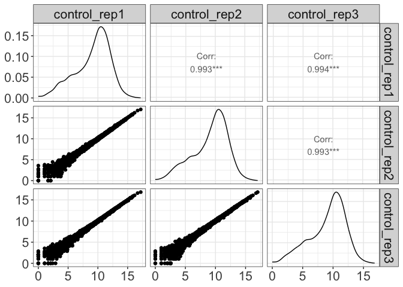<!-- -->

    #> 
    #> $treatment1

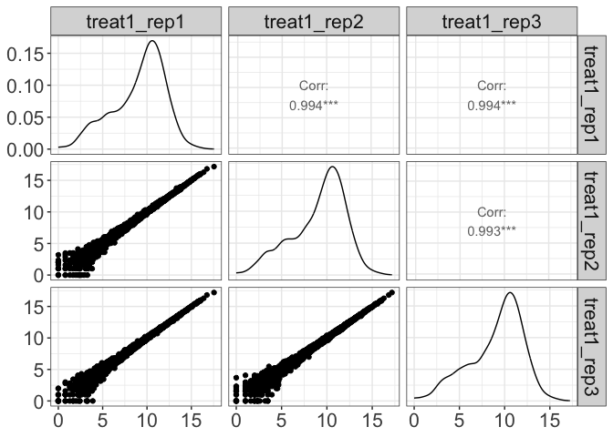<!-- -->

### Visualize all sample correlation by heat box

``` r
parcutils::get_corr_heatbox(x = res, show_corr_values = T, cluster_samples = F)
```

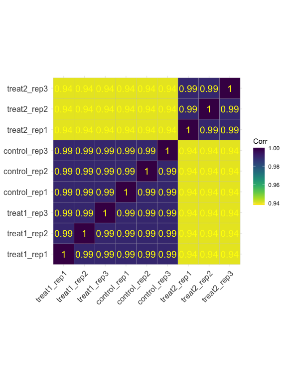<!-- -->

### Visualize samples by Principle Component Analysis (PCA)

``` r

parcutils::get_pca_plot(x = res, 
                        samples  =c("control" ,"treatment1" ,"treatment2"))
```

<!-- -->

### Counts of diff expressed genes

``` r

parcutils::get_diff_gene_count_barplot(x = res)
```

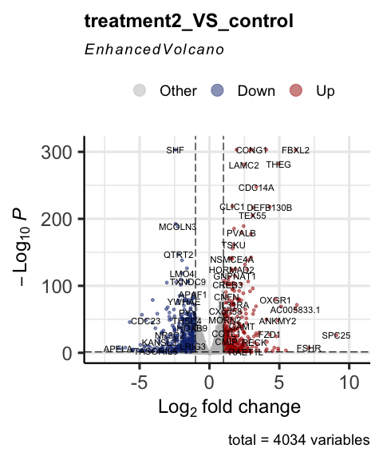<!-- -->

change color of the bars

``` r

parcutils::get_diff_gene_count_barplot(x = res, col_down = "green4")
```

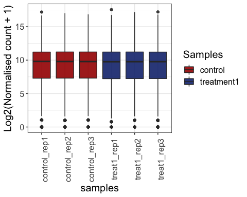<!-- -->

### Visualize differential expressed genes by volcano plot

``` r


parcutils::get_volcano_plot(x = res, sample_comparison = "treatment2_VS_control",
                            col_up = "#a40000",
                            col_down = "#16317d", 
                            repair_genes = T,
                            col_other = "grey")
```

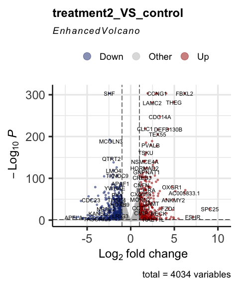<!-- -->

``` r

# change cutoffs 

parcutils::get_volcano_plot(x = res, repair_genes = T,
                            sample_comparison = "treatment2_VS_control",
                            pval_cutoff = 0.01,
                            log2fc_cutoff = 0.6, 
                            col_up = "#a40000",
                            col_down = "#16317d",
                            col_other = "grey")
```

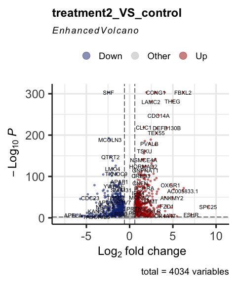<!-- -->

### Visualize gene expression distribution using box plot

``` r

# all replicates 
parcutils::get_gene_expression_box_plot(x = res, 
                                        samples =c("control" ,"treatment1"), 
                                        group_replicates = FALSE,
                                        convert_log2 = T)
```

<!-- -->

``` r
# summarise  replicates 
parcutils::get_gene_expression_box_plot(x = res, 
                                        samples =c("control" ,"treatment1"), 
                                        group_replicates = T,
                                        convert_log2 = T)
```

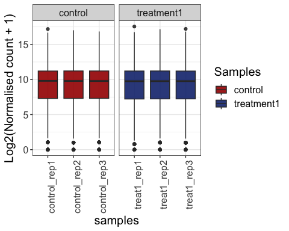<!-- -->

### Visualize genes by heatmaps

``` r


genes_for_hm = parcutils::get_genes_by_regulation(x = res,
                                                  sample_comparison = res$de_comparisons[[2]], 
                                                  regulation = "both")

# heatmap of normalised gene expression values across samples 

hm1 <- parcutils::get_gene_expression_heatmap(x = res, 
                                       samples = c("control","treatment1" , "treatment2") , 
                                       genes = genes_for_hm %>% names() , 
                                       convert_zscore = FALSE, 
                                       convert_log2 = T, 
                                       summarise_replicates = T,
                                       name = "log2(value)" , color_default = F, 
                                       col = 
                                         circlize::colorRamp2(breaks = c(-5,0,15), colors = c("#16317d","white","#a40000")),
                                       cluster_columns = FALSE)

ComplexHeatmap::draw(hm1)
```

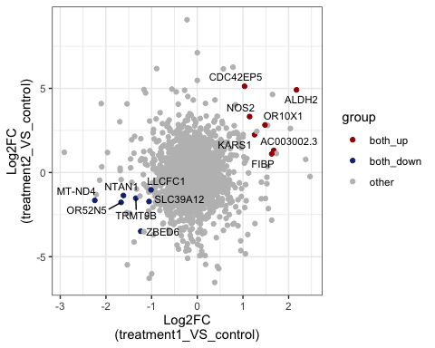<!-- -->

``` r

# Visualise  z-score and show all replicates.

hm2 <- parcutils::get_gene_expression_heatmap(x = res, 
                                       samples = c("control","treatment1") , 
                                       name = "Z-score",
                                       summarise_replicates = F,
                                        col = 
                                         circlize::colorRamp2(breaks = c(-2,0,2), colors = c("#16317d","white","#a40000")),color_default = F,
                                       genes = genes_for_hm %>% names() , 
                                       convert_zscore = TRUE, 
                                       cluster_columns = FALSE)


ComplexHeatmap::draw(hm2)
```

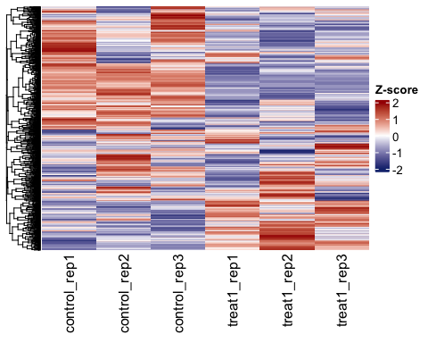<!-- -->

``` r

# log2 FC heatamap
hm3 <- parcutils::get_fold_change_heatmap(x = res, 
                                   sample_comparisons = res$de_comparisons, 
                                   genes = genes_for_hm %>% names() , 
                                   color_default = F, 
                                     col = 
                                         circlize::colorRamp2(breaks = c(-5,0,5), colors = c("#16317d","white","#a40000")),
                                   name= "Log2FC")

ComplexHeatmap::draw(hm3)
```

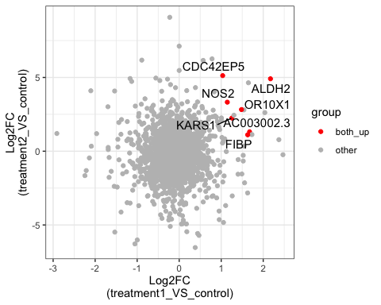<!-- -->

### Visualize differential genes overlap between comparison

``` r

us_plot <- parcutils::plot_deg_upsets(x = res, 
                                      sample_comparisons = res$de_comparisons)

us_plot$treatment1_VS_control_AND_treatment2_VS_control$upset_plot %>% print()
```

<!-- -->

``` r

# get list of intersecting genes. 

us_plot$treatment1_VS_control_AND_treatment2_VS_control$upset_intersects %>% print()
#> # A tibble: 7 × 2
#>   set                                                   elements   
#>   <chr>                                                 <list>     
#> 1 treatment1_VS_control_up                              <chr [6]>  
#> 2 treatment1_VS_control_up,treatment2_VS_control_up     <chr [7]>  
#> 3 treatment2_VS_control_up                              <chr [318]>
#> 4 treatment2_VS_control_up,treatment1_VS_control_down   <chr [8]>  
#> 5 treatment1_VS_control_down,treatment2_VS_control_down <chr [7]>  
#> 6 treatment1_VS_control_down                            <chr [13]> 
#> 7 treatment2_VS_control_down                            <chr [495]>
```

### Visualize common DE genes between comparison by scatter plot

``` r

# show common up and down genes 
parcutils::get_fold_change_scatter_plot(x = res, 
                                                   sample_comparisons = res$de_comparisons, point_size = 3,label_size = 3,repair_genes = T)
```

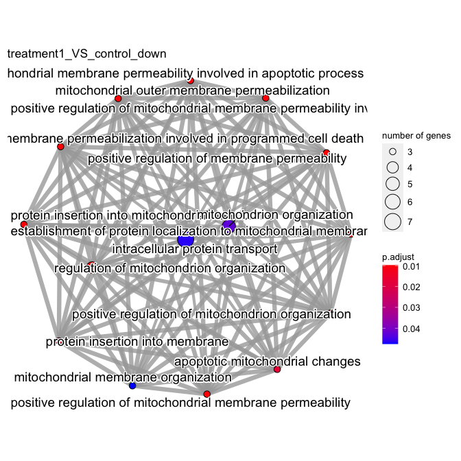<!-- -->

``` r

# show common up and down genes 
parcutils::get_fold_change_scatter_plot(x = res, 
                                        sample_comparisons = res$de_comparisons, 
                                        point_size = 3,
                                        label_size = 3,
                                        repair_genes = T)
```

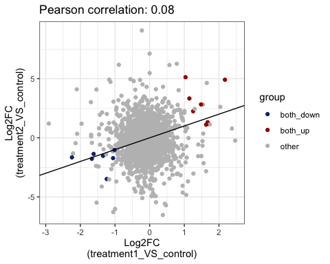<!-- -->

``` r

# show common up genes
parcutils::get_fold_change_scatter_plot(x = res, 
                                        sample_comparisons = res$de_comparisons, 
                                        point_size = 5,
                                        label_size = 4,
                                        color_label = "both_up",
                                        col_up = "red",
                                        repair_genes = T)
```

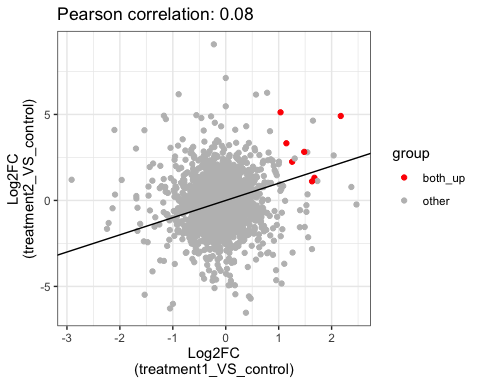<!-- -->

``` r


# show common down genes
parcutils::get_fold_change_scatter_plot(x = res, 
                                        sample_comparisons = res$de_comparisons, 
                                        point_size = 5,
                                        label_size = 4,
                                        color_label = "both_down",
                                        col_down = "green4",
                                        repair_genes = T)
```

<!-- -->

### Visualize genes by line plot

``` r


genes_for_lineplot = parcutils::get_genes_by_regulation(x = res,
                                                  sample_comparison = res$de_comparisons[[2]], 
                                                  regulation = "both") %>% names()

# line plot of gene expression values
parcutils::get_gene_expression_line_plot(x = res, 
                                   genes = genes_for_lineplot , 
                                   samples = c("control","treatment1","treatment2"),summarise_replicates = T, show_average_line = T) + 
  ggplot2::theme(text = ggplot2::element_text(size = 15))
```

<!-- -->

``` r


# line plot of gene expression values with k-means clustering  

parcutils::get_gene_expression_line_plot(x = res, 
                                         km = 4,
                                   genes = genes_for_lineplot , 
                                   samples = c("control","treatment1","treatment2"),summarise_replicates = T, show_average_line = T) + 
  ggplot2::theme(text = ggplot2::element_text(size = 15))
```

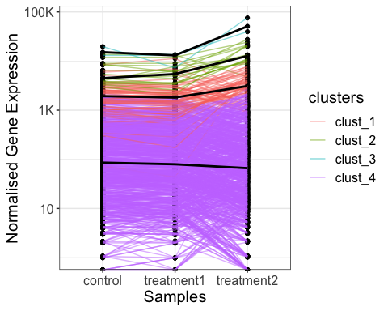<!-- -->

``` r

# line plot of gene expression values with k-means clustering  

parcutils::get_gene_expression_line_plot(x = res, 
                                         km = 4, 
                                         facet_clusters = T,
                                   genes = genes_for_lineplot , 
                                   samples = c("control","treatment1","treatment2"),summarise_replicates = T, show_average_line = T) + 
  ggplot2::theme(text = ggplot2::element_text(size = 15), 
                 axis.text.x = ggplot2::element_text(angle = 40,hjust = 0.8))
```

<!-- -->

``` r

# Fold change values 

parcutils::get_fold_change_line_plot(x = res, 
                                   genes = genes_for_lineplot , 
                                   line_transparency = 0.5, 
                                   km = 2,facet_clusters = T,
                                     sample_comparisons = c("treatment1_VS_control", "treatment2_VS_control"), 
                                   average_line_summary_method =  "mean",
                                   show_average_line = T) + 
  ggplot2::theme(text = ggplot2::element_text(size = 15),
                 axis.text.x = ggplot2::element_text(angle = 40,hjust = 0.8))
```

<!-- -->

## Perform gene ontology analysis and visualization of all UP/DOWN genes from all comparisons in one go.

``` r
go_results <- parcutils::get_go_emap_plot(x = res)

# GO results as a table 

go_results$go_enrichment_output
#> list()

# GO results as an emap plot 

go_results$go_emap_plots
#> NULL
```

## Other functions

### Alignment summary

``` r

star_align_log_file <- system.file("extdata" , "a_Log.final.out" , package = "parcutils")

x =  parcutils::get_star_align_log_summary(log_file = star_align_log_file)

print(x)
#> # A tibble: 13 × 2
#>    type                                    val     
#>    <chr>                                   <chr>   
#>  1 Number of input reads                   41936201
#>  2 Uniquely mapped reads number            40090105
#>  3 Uniquely mapped reads %                 95.60%  
#>  4 Average input read length               300     
#>  5 Average mapped length                   298.24  
#>  6 Number of reads mapped to multiple loci 900879  
#>  7 % of reads mapped to multiple loci      2.15%   
#>  8 Number of reads mapped to too many loci 9335    
#>  9 % of reads mapped to too many loci      0.02%   
#> 10 Number of reads unmapped: too short     921464  
#> 11 % of reads unmapped: too short          2.20%   
#> 12 Number of reads unmapped: other         14418   
#> 13 % of reads unmapped: other              0.03%


# plot alignment summary


star_align_log_file_dir <- system.file("extdata" , package = "parcutils")

star_align_log_files <- fs::dir_ls(star_align_log_file_dir, 
                                   glob = "*Log.final.out" ,
                                   recurse = T,type = "file")
names(star_align_log_files) <- NULL
parcutils::get_star_align_log_summary_plot(x = star_align_log_files,
                                col_total_reads = "red", 
                                col_mapped_reads  = "blue") 
```

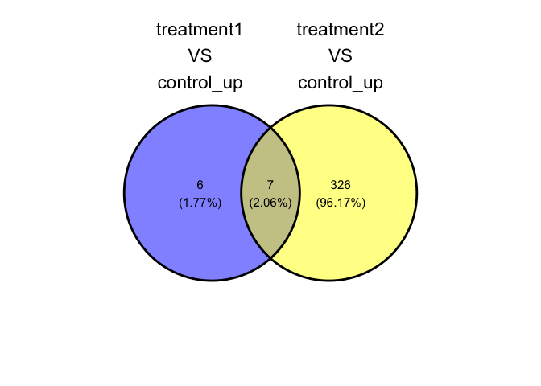<!-- -->

## 
