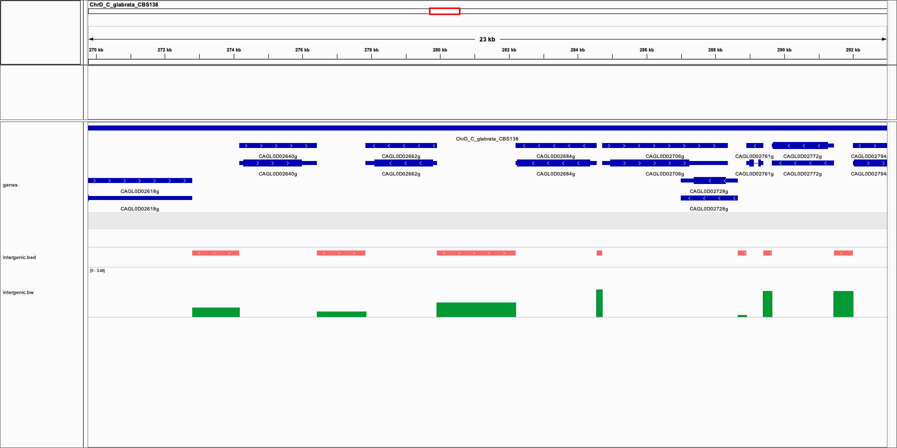

<!-- README.md is generated from README.Rmd. Please edit that file -->

# parcutils

<!-- badges: start -->

[](https://github.com/cparsania/parcutils)
[](https://www.tidyverse.org/lifecycle/#experimental)

<!-- badges: end -->

The goal of parcutils is to provide day to day bioinformatics utility
functions. Those functions are mostly wrapper functions written on top
of core bioconductior fucntions.

## Installation

``` r

if(require("devtools")){
        devtools::install_github("cparsania/parcutils")
} else{
        install.packages("devtools")
        devtools::install_github("cparsania/pparcutils")
}
```

## Example

This is a basic example which shows you how to solve a common problem:

## Intergenic regions and signal intensity

Given the .gff file and .bw file, identify genome wide intergenic
regions and their signal intensity.

``` r
library(parcutils)


bw_file <- system.file("extdata" , "example.bw" , package = "parcutils")
gff_file <- system.file("extdata" , "C_glabrata_CBS138_version_s02-m07-r06_features.gff" ,package = "parcutils")

oo <- parcutils::get_intergenic_singals(bw_file = bw_file,gff_file  = gff_file)

oo 
#> GRanges object with 3715 ranges and 1 metadata column:
#>                        seqnames      ranges strand |            score
#>                           <Rle>   <IRanges>  <Rle> |        <numeric>
#>      [1] ChrA_C_glabrata_CBS138      1-1607      + | 1.08452520981737
#>      [2] ChrA_C_glabrata_CBS138   2637-2670      + | 14.5011175941018
#>      [3] ChrA_C_glabrata_CBS138  4810-11696      + | 1.98691039911389
#>      [4] ChrA_C_glabrata_CBS138 13043-14976      + | 7.80336749689286
#>      [5] ChrA_C_glabrata_CBS138 15887-17912      + | 4.28256952397797
#>      ...                    ...         ...    ... .              ...
#>   [3711] mito_C_glabrata_CBS138 17988-18003      + | 6.55200004577637
#>   [3712] mito_C_glabrata_CBS138 18076-18084      + | 6.55200004577637
#>   [3713] mito_C_glabrata_CBS138 18157-18179      + | 5.59056505949601
#>   [3714] mito_C_glabrata_CBS138 18263-18280      + | 4.09499979019165
#>   [3715] mito_C_glabrata_CBS138 18368-18403      + | 2.84375001986822
#>   -------
#>   seqinfo: 14 sequences from an unspecified genome; no seqlengths
```

Export results

``` r
## export bed file 

oo %>% rtracklayer::export.bed(con = file(paste("intergenic", ".bed",sep = "")))

## export bdg file

oo %>% rtracklayer::export.bedGraph(con = file(paste("intergenic", ".bdg",sep = "")))
```

Below is the IGV snapshot showing genes(blue), intergenic regions (red)
and intergenic intensities (green).


