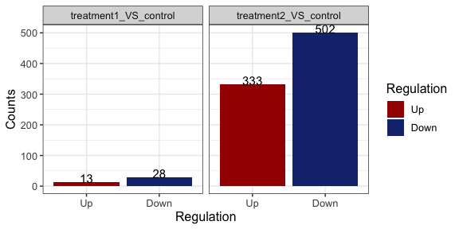

<!-- README.md is generated from README.Rmd. Please edit that file -->

# parcutils

<!-- badges: start -->

[](https://github.com/cparsania/parcutils)
[](https://lifecycle.r-lib.org/articles/stages.html#experimental)

<!-- badges: end -->

The goal of `parcutils` is to provide day to day bioinformatics utility
functions. Most of the functions in the package are useful for analyzing
and visualizing complex RNA-seq studies.

## Installation

``` r

if(require("devtools") && require("BiocManager")){
  options(repos = BiocManager::repositories() )
  devtools::install_github("cparsania/parcutils")
} else{
  install.packages(c("devtools","BiocManager"))
  options(repos = BiocManager::repositories() )
  devtools::install_github("cparsania/parcutils")
}
```

## RNA-seq analysis

### Differential expression analysis

#### Prepare a count table

``` r
count_file <- system.file("extdata","toy_counts.txt" , package = "parcutils")

count_data <- readr::read_delim(count_file, delim = "\t")

count_data 
#> # A tibble: 5,000 × 10
#>    gene_id        control_rep1 control_rep2 control_rep3 treat1_rep1 treat1_rep2
#>    <chr>                 <dbl>        <dbl>        <dbl>       <dbl>       <dbl>
#>  1 ENSG000001735…            0            0            0           0           0
#>  2 ENSG000001063…            1            0            2           0           0
#>  3 ENSG000001311…            2            0            2           0           0
#>  4 ENSG000001543…          652          690          639         607         453
#>  5 ENSG000001964…         3372         3631         3188        4644        3168
#>  6 ENSG000001730…          694          784          829         974         580
#>  7 ENSG000001405…           87           73           81         100          77
#>  8 ENSG000001875…            4            4            2           0           5
#>  9 ENSG000001392…         1374         1789         1564        1933        1459
#> 10 ENSG000001658…         3639         4533         3921        3879        3500
#> # … with 4,990 more rows, and 4 more variables: treat1_rep3 <dbl>,
#> #   treat2_rep1 <dbl>, treat2_rep2 <dbl>, treat2_rep3 <dbl>
```

#### Group replicates by samples.

To run DESeq2 sample replicates replicates needs to be grouped by
sample.

``` r
sample_info <- count_data %>% colnames() %>% .[-1]  %>%
 tibble::tibble(samples = . , groups = rep(c("control" ,"treatment1" , "treatment2") , 
                                           each = 3))
sample_info
#> # A tibble: 9 × 2
#>   samples      groups    
#>   <chr>        <chr>     
#> 1 control_rep1 control   
#> 2 control_rep2 control   
#> 3 control_rep3 control   
#> 4 treat1_rep1  treatment1
#> 5 treat1_rep2  treatment1
#> 6 treat1_rep3  treatment1
#> 7 treat2_rep1  treatment2
#> 8 treat2_rep2  treatment2
#> 9 treat2_rep3  treatment2
```

#### Run `DESeq2` for multiple differential gene comparison.

``` r
res <- parcutils::run_deseq_analysis(counts = count_data ,
                         sample_info = sample_info,
                         column_geneid = "gene_id" ,
                         log2fc_cutoff = 0.6,
                         cutoff_pval = 0.05,
                         group_numerator = c("treatment1", "treatment2") ,
                         group_denominator = c("control"),
                         column_samples = c("control_rep1", "treat1_rep1", "treat2_rep1", "control_rep2", "treat1_rep2", "treat2_rep2", "control_rep3", "treat1_rep3", "treat2_rep3"))
```

#### Let’s have a look in to `res`

``` r
res
#> # A tibble: 2 × 8
#>   comp     numerator  denominator norm_counts  dsr    dsr_tibble  dsr_tibble_deg
#>   <chr>    <chr>      <chr>       <named list> <name> <named lis> <named list>  
#> 1 treatme… treatment1 control     <named list… <DESq… <tibble [4… <tibble [4,03…
#> 2 treatme… treatment2 control     <named list… <DESq… <tibble [4… <tibble [4,03…
#> # … with 1 more variable: deg_summmary <named list>
```

`res` is an object of improved `dataframe` - `tibble`. Each row in the
`res` is a differential comparison which can be identified by the value
from the column `comp`.

``` r
res$comp
#> [1] "treatment1_VS_control" "treatment2_VS_control"
```

Data related to each differential comparison can be found from other
columns of `res`.

For example, summary of differently expressed genes can be found from
the column `deg_summmary`

``` r
res$deg_summmary
#> $treatment1_VS_control
#> # A tibble: 3 × 2
#>   regul     n
#>   <chr> <int>
#> 1 Down     28
#> 2 other  3993
#> 3 Up       13
#> 
#> $treatment2_VS_control
#> # A tibble: 3 × 2
#>   regul     n
#>   <chr> <int>
#> 1 Down    502
#> 2 other  3199
#> 3 Up      333
```

As described below there are several helper functions to get data from
the `res` .

## Get data from `res` using helper functions

``` r
# get normalised gene expression value for all genes across all samples. 
parcutils::get_normalised_expression_matrix(x = res, 
                                            samples = NULL,
                                            genes = NULL,
                                            summarise_replicates = FALSE)
#> # A tibble: 4,034 × 10
#>    gene_id         treat1_rep1 treat1_rep2 treat1_rep3 control_rep1 control_rep2
#>    <chr>                 <dbl>       <dbl>       <dbl>        <dbl>        <dbl>
#>  1 ENSG0000015434…      440.        461.       456.           694.        687.  
#>  2 ENSG0000019641…     3370.       3222.      3478.          3591.       3616.  
#>  3 ENSG0000017302…      707.        590.       709.           739.        781.  
#>  4 ENSG0000014059…       72.6        78.3       71.3           92.7        72.7 
#>  5 ENSG0000013926…     1403.       1484.      1568.          1463.       1781.  
#>  6 ENSG0000016589…     2815.       3559.      3404.          3875.       4514.  
#>  7 ENSG0000017945…    12679.      12542.     13690.         13257.      13358.  
#>  8 ENSG0000018886…      461.        434.       459.           540.        592.  
#>  9 ENSG0000024915…        0           2.03       0.990          0          11.0 
#> 10 ENSG0000011085…        2.18        9.15       9.90          11.7         5.97
#> # … with 4,024 more rows, and 4 more variables: control_rep3 <dbl>,
#> #   treat2_rep1 <dbl>, treat2_rep2 <dbl>, treat2_rep3 <dbl>

# average gene expression values across relicates  
parcutils::get_normalised_expression_matrix(x = res, 
                                            samples = NULL,
                                            genes = NULL,
                                            summarise_replicates = T, 
                                            summarise_method = "median")
#> # A tibble: 4,034 × 4
#>    gene_id                  control treatment1 treatment2
#>    <chr>                      <dbl>      <dbl>      <dbl>
#>  1 ENSG00000000971:CFH       7349.      5727.      9849. 
#>  2 ENSG00000001461:NIPAL3     134.       126.        68.2
#>  3 ENSG00000001497:LAS1L     9282.      8228.      7678. 
#>  4 ENSG00000001631:KRIT1    23294.     29183.     20375. 
#>  5 ENSG00000002746:HECW1       66.0       31.9       24.9
#>  6 ENSG00000003056:M6PR      6538.      7394.      6694. 
#>  7 ENSG00000003436:TFPI       248.       225.       200. 
#>  8 ENSG00000003509:NDUFAF7    462.       495.       384. 
#>  9 ENSG00000004766:VPS50       40.2       38.6      121. 
#> 10 ENSG00000004864:SLC25A13   370.       396.       844. 
#> # … with 4,024 more rows


# get fold change values for all genes and all comparisons.

q_genes = c("ENSG00000196415:PRTN3", "ENSG00000221988:PPT2", "ENSG00000163138:PACRGL", "ENSG00000183840:GPR39", "ENSG00000146700:SSC4D", "ENSG00000163746:PLSCR2", "ENSG00000155918:RAET1L", "ENSG00000151458:ANKRD50", "ENSG00000167074:TEF", "ENSG00000130159:ECSIT")

parcutils::get_fold_change_matrix(x = res, sample_comparisons = res$comp, 
                                  genes = q_genes)
#> # A tibble: 10 × 3
#>    gene_id                 treatment1_VS_control treatment2_VS_control
#>    <chr>                                   <dbl>                 <dbl>
#>  1 ENSG00000196415:PRTN3                 -0.0714                 0.729
#>  2 ENSG00000221988:PPT2                   0.0769                 0.699
#>  3 ENSG00000163138:PACRGL                 0.173                  0.691
#>  4 ENSG00000183840:GPR39                  0.170                  0.904
#>  5 ENSG00000146700:SSC4D                  0.0793                 0.773
#>  6 ENSG00000163746:PLSCR2                 0.0321                 0.747
#>  7 ENSG00000155918:RAET1L                 0.467                  2.63 
#>  8 ENSG00000151458:ANKRD50               -0.0441                 1.91 
#>  9 ENSG00000167074:TEF                   -0.0815                 0.681
#> 10 ENSG00000130159:ECSIT                  0.0317                 0.751


# get differentially expressed genes for given comparison 

parcutils::get_genes_by_regulation(x = res, 
                                  sample_comparison = "treatment1_VS_control", 
                                  regulation = "both" # can be one of the "up" , "down" , "both", "other", "all"
                                  )
#>                           up                           up 
#>       "ENSG00000187193:MT1X" "ENSG00000269533:AC003002.3" 
#>                           up                           up 
#>      "ENSG00000065427:KARS1"       "ENSG00000007171:NOS2" 
#>                           up                           up 
#>     "ENSG00000285447:ZNF883"      "ENSG00000111275:ALDH2" 
#>                           up                           up 
#>     "ENSG00000279111:OR10X1"   "ENSG00000167617:CDC42EP5" 
#>                           up                           up 
#>    "ENSG00000186566:GPATCH8"    "ENSG00000232423:PRAMEF6" 
#>                           up                           up 
#>    "ENSG00000182103:FAM181B"       "ENSG00000172500:FIBP" 
#>                           up                         down 
#>      "ENSG00000151033:LYZL2"     "ENSG00000250305:TRMT9B" 
#>                         down                         down 
#>      "ENSG00000134308:YWHAQ"    "ENSG00000123575:FAM199X" 
#>                         down                         down 
#>   "ENSG00000148482:SLC39A12"      "ENSG00000175264:CHST1" 
#>                         down                         down 
#>      "ENSG00000141933:TPGS1"      "ENSG00000165621:OXGR1" 
#>                         down                         down 
#>        "ENSG00000104081:BMF"       "ENSG00000278023:RDM1" 
#>                         down                         down 
#>    "ENSG00000172264:MACROD2"       "ENSG00000162971:TYW5" 
#>                         down                         down 
#>     "ENSG00000198682:PAPSS2"      "ENSG00000125445:MRPS7" 
#>                         down                         down 
#>   "ENSG00000138670:RASGEF1B"      "ENSG00000124839:RAB17" 
#>                         down                         down 
#>      "ENSG00000069869:NEDD4"      "ENSG00000174576:NPAS4" 
#>                         down                         down 
#>    "ENSG00000143514:TP53BP2"     "ENSG00000181009:OR52N5" 
#>                         down                         down 
#>      "ENSG00000257315:ZBED6"      "ENSG00000141748:ARL5C" 
#>                         down                         down 
#>     "ENSG00000198886:MT-ND4"      "ENSG00000157045:NTAN1" 
#>                         down                         down 
#>     "ENSG00000165131:LLCFC1"   "ENSG00000277611:Z98752.3" 
#>                         down                         down 
#>    "ENSG00000158089:GALNT14"      "ENSG00000124784:RIOK1" 
#>                         down 
#>       "ENSG00000103197:TSC2"

# get replicates group data 

parcutils::group_replicates_by_sample(res)
#> # A tibble: 9 × 2
#>   groups     samples     
#>   <chr>      <chr>       
#> 1 treatment1 treat1_rep1 
#> 2 treatment1 treat1_rep2 
#> 3 treatment1 treat1_rep3 
#> 4 control    control_rep1
#> 5 control    control_rep2
#> 6 control    control_rep3
#> 7 treatment2 treat2_rep1 
#> 8 treatment2 treat2_rep2 
#> 9 treatment2 treat2_rep3
```

## Generate several visualizations from `res`

### Visualize pairwise correlation between replicates

``` r
parcutils::get_pairwise_corr_plot(res, samples =c("control" ,"treatment1"))
#> Registered S3 method overwritten by 'GGally':
#>   method from   
#>   +.gg   ggplot2
#> $control
```


    #> 
    #> $treatment1


### Visualize samples by Principle Component Analysis (PCA)

``` r
parcutils::get_pca_plot(x = res, 
                        samples  =c("control" ,"treatment1" ,"treatment2"))
```


### Visualize differential expressed genes by volcano plot

``` r

parcutils::get_volcano_plot(x = res, sample_comparison = "treatment2_VS_control",
                            col_up = "#a40000",
                            col_down = "#007e2f", 
                            col_other = "grey")
#> Registered S3 methods overwritten by 'ggalt':
#>   method                  from   
#>   grid.draw.absoluteGrob  ggplot2
#>   grobHeight.absoluteGrob ggplot2
#>   grobWidth.absoluteGrob  ggplot2
#>   grobX.absoluteGrob      ggplot2
#>   grobY.absoluteGrob      ggplot2
#> Warning: One or more p-values is 0. Converting to 10^-1 * current lowest non-
#> zero p-value...
#> Warning: Ignoring unknown parameters: xlim, ylim
```


``` r
# change cutoffs 

parcutils::get_volcano_plot(x = res, 
                            sample_comparison = "treatment2_VS_control",
                            pval_cutoff = 0.01,
                            log2fc_cutoff = 0.6, 
                            col_up = "#a40000",
                            col_down = "#007e2f",
                            col_other = "grey")
#> Warning: One or more p-values is 0. Converting to 10^-1 * current lowest non-
#> zero p-value...

#> Warning: Ignoring unknown parameters: xlim, ylim
```


### Visualize gene expression distribution using box plot

``` r
# all replicates 
parcutils::get_gene_expression_box_plot(x = res, 
                                        samples =c("control" ,"treatment1"), 
                                        group_replicates = FALSE,
                                        convert_log2 = T)
```


``` r
# summarise  replicates 
parcutils::get_gene_expression_box_plot(x = res, 
                                        samples =c("control" ,"treatment1"), 
                                        group_replicates = T,
                                        convert_log2 = T)
```


### Visualize genes by heatmaps

``` r


genes_for_hm = parcutils::get_genes_by_regulation(x = res,
                                                  sample_comparison = res$comp[[2]], 
                                                  regulation = "both")

# heatmap of normalised gene expression values across samples 

hm1 <- parcutils::get_gene_expression_heatmap(x = res, 
                                       samples = c("control","treatment1" , "treatment2") , 
                                       genes = genes_for_hm , 
                                       convert_zscore = FALSE, 
                                       convert_log2 = T, 
                                       summarise_replicates = T,
                                       name = "log2(value)" , 
                                       cluster_columns = FALSE)

ComplexHeatmap::draw(hm1)
```



``` r
# Visualise  z-score and show all replicates.

hm2 <- parcutils::get_gene_expression_heatmap(x = res, 
                                       samples = c("control","treatment1") , 
                                       name = "Z-score",
                                       summarise_replicates = F, 
                                       genes = genes_for_hm , 
                                       convert_zscore = TRUE, 
                                       cluster_columns = FALSE)
#> Warning in parcutils::get_gene_expression_heatmap(x =
#> res, samples = c("control", : Genes having value NA -
#> ENSG00000170820:FSHR,ENSG00000129862:VCY1B are removed from heatmap.


ComplexHeatmap::draw(hm2)
```


``` r
# log2 FC heatamap
hm3 <- parcutils::get_fold_change_heatmap(x = res, 
                                   sample_comparisons = res$comp, 
                                   genes = genes_for_hm , 
                                   name= "Log2FC")

ComplexHeatmap::draw(hm3)
```


### Visualize differential genes overlap between comparison

``` r
us_plot <- parcutils::plot_deg_upsets(x = res, sample_comparisons = res$comp)

us_plot$treatment1_VS_control_AND_treatment2_VS_control$upset_plot %>% print()
```


``` r
# get list of intersecting genes. 

us_plot$treatment1_VS_control_AND_treatment2_VS_control$upset_intersects %>% print()
#> # A tibble: 7 × 2
#>   set                                                   elements   
#>   <chr>                                                 <list>     
#> 1 treatment1_VS_control_up                              <chr [6]>  
#> 2 treatment1_VS_control_up,treatment2_VS_control_up     <chr [7]>  
#> 3 treatment2_VS_control_up                              <chr [318]>
#> 4 treatment2_VS_control_up,treatment1_VS_control_down   <chr [8]>  
#> 5 treatment1_VS_control_down,treatment2_VS_control_down <chr [7]>  
#> 6 treatment1_VS_control_down                            <chr [13]> 
#> 7 treatment2_VS_control_down                            <chr [495]>
```

## Other functions

### Alignment summary

``` r
star_align_log_file <- system.file("extdata" , "a_Log.final.out" , package = "parcutils")

x =  parcutils::get_star_align_log_summary(log_file = star_align_log_file)

print(x)
#> # A tibble: 13 × 2
#>    type                                    val     
#>    <chr>                                   <chr>   
#>  1 Number of input reads                   41936201
#>  2 Uniquely mapped reads number            40090105
#>  3 Uniquely mapped reads %                 95.60%  
#>  4 Average input read length               300     
#>  5 Average mapped length                   298.24  
#>  6 Number of reads mapped to multiple loci 900879  
#>  7 % of reads mapped to multiple loci      2.15%   
#>  8 Number of reads mapped to too many loci 9335    
#>  9 % of reads mapped to too many loci      0.02%   
#> 10 Number of reads unmapped: too short     921464  
#> 11 % of reads unmapped: too short          2.20%   
#> 12 Number of reads unmapped: other         14418   
#> 13 % of reads unmapped: other              0.03%


# plot alignment summary


star_align_log_file_dir <- system.file("extdata" , package = "parcutils")

star_align_log_files <- fs::dir_ls(star_align_log_file_dir, 
                                   glob = "*Log.final.out" ,
                                   recurse = T,type = "file")
names(star_align_log_files) <- NULL
parcutils::get_star_align_log_summary_plot(x = star_align_log_files,
                                col_total_reads = "red", 
                                col_mapped_reads  = "blue") 
```


## 
